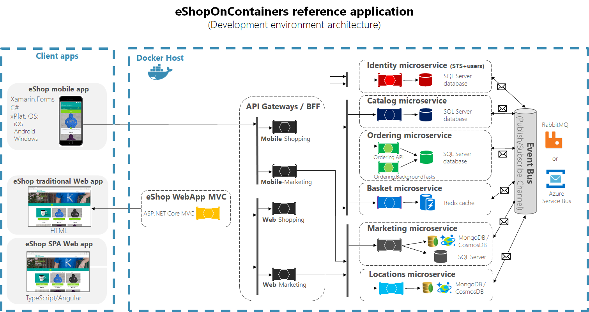

- title : Les métiers du développement d'application
- description : 
- author : Rajiv MOUNGUENGUE
- theme : night
- transition : zoom

***************************************************************************************************
- id : title
  

## Les métiers du développement d'application

  
##### Présenté par Rajiv MOUNGUENGUE

[@rajivhost](https://twitter.com/rajivhost) | [FunctionalStack, Inc.](https://fsharping.com)

***************************************************************************************************
- id : functional-stack
  
### [ ] FunctionalStack
  
Société de service, spécialisée dans le developpement  de logiciel depuis 2016.

***************************************************************************************************
- id : moderm-app

### Architecture des applications modernes

***************************************************************************************************
- id : developers-profils

### Les differents métiers

---------------------------------------------------------------------------------------------------
- id : back-end-devs

### Les développeurs Back-end

Ce profil est demandé pour concevoir les applications qui tournent coté serveur, à savoir:

- Les Web Services (ou API Web GraphQL, REST, gRpc ...);
- Les Services Windows;
- Les bases de données (SQL Server, Oracle, Couchbase ...)

Les differentes technologies: .NET, NodeJs, Scala, Python ...

---------------------------------------------------------------------------------------------------
- id : front-end-devs

### Les developpeurs Front-end

Ce profil est demandé pour concevoir les differents clients utilisateurs, à savoir:

- Les clients Web (Javascript, ReasonML, CSS, HTML, NET ...);
- Les clients Desktop (.NET, Java, Javascript, ReasonML, Elm, ...);
- Les clients Mobile (.NET, Java, Javascript, ReasonML ...);

---------------------------------------------------------------------------------------------------
- id : full-stack-devs

### Les developpeurs Full-stack

Ce profil a les competences nécessaires pour intervenir aussi bien sur les questions du front-end que du back-end

***************************************************************************************************
- id : motivation

## En résumé, pourquoi se former au code aujourd’hui ?

---------------------------------------------------------------------------------------------------
- id : motivation-1

### Parce que tout le monde vous veut

Selon une étude LinkedIn/Le Monde, le metier de développeur est le plus recherché par les recruteurs en France et est considéré comme le job #1 en tech avec la plus forte croissance en terme d’offres d’emploi (+27 % d’ici 2024).

---------------------------------------------------------------------------------------------------
- id : motivation-2

### Parce que le code est accessible à tous

Le code est accessible à tous le monde, peu importe les diplômes obtenus ou non, et bien entendu aux femmes! S’il faut avoir une certaine logique et être rigoureux, pas besoin d’être un crack en maths pour être développeur.

---------------------------------------------------------------------------------------------------
- id : motivation-3

### Parce que la carrière et le salaire sont intéressants

En france, le revenu annuel médian des développeurs est de 41.764 euros (baromètre 2016, Stack Overflow). Après avoir évolué comme développeur junior puis senior, vous pourrez vous diriger vers d’autres métiers: Lead Développeur, Chef de projet, Growth hacker ou Product Manager.

---------------------------------------------------------------------------------------------------
- id : motivation-4

### Parce que les horaires et les modes de travail sont flexibles

Bon nombre d’entreprises ont compris que l’essentiel c’est la qualité du code produit et laissent leur développeurs pratiquer des horaires flexibles ou du télétravail.

---------------------------------------------------------------------------------------------------
- id : motivation-5

### Parce que c'est gratifiant

Ce sera en grande partie grâce à vous que votre entreprise pourra développer de nouveaux produits et applications, les présenter sur sont sites à ses clients, booster sa croissance. Vous aurez droit à la reconnaissance de vos collaborateurs et de votre employeur.

---------------------------------------------------------------------------------------------------
- id : motivation-6

### Parce que vous entrerez dans une communauté dynamique et soudée

La communauté des développeurs est très forte et soudée, en France et à l’international. Meetups, conférences, projets open-sources, hackathons, devenir développeur c’est vraiment ouvrir sa vie aux opportunités, à l’échange et aux autres.

---------------------------------------------------------------------------------------------------
- id : motivation-7

### Parce que le code, c'est la vie

Votre iPhone ? Du code, Facebook ? Du code. Le code est universel. Le code est omniprésent. En devenant développeur, vous devenez acteur du monde digital, bâtisseur des cathédrales d’aujourd’hui.

***************************************************************************************************
- id : qa

# Merci de votre attention
### Question ?